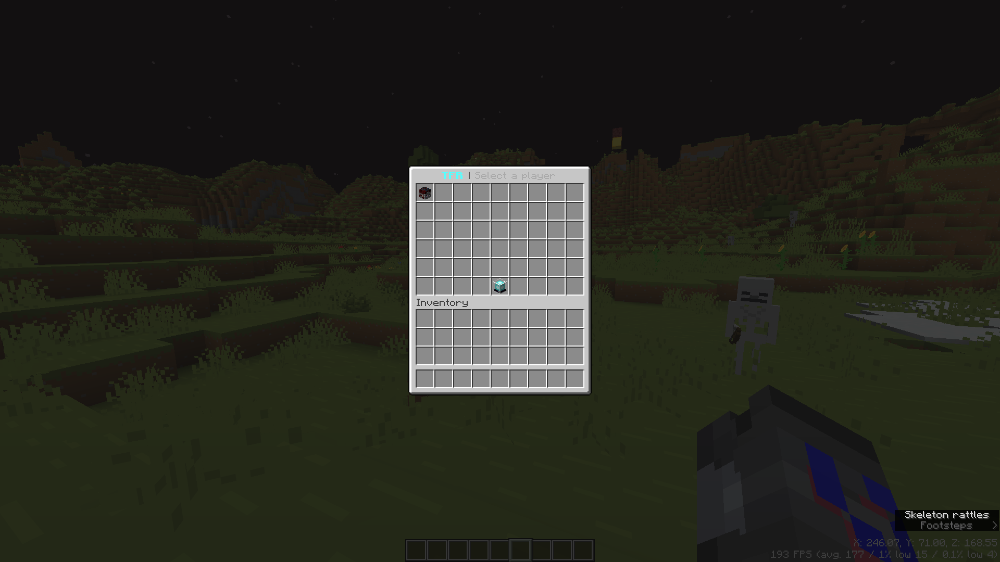
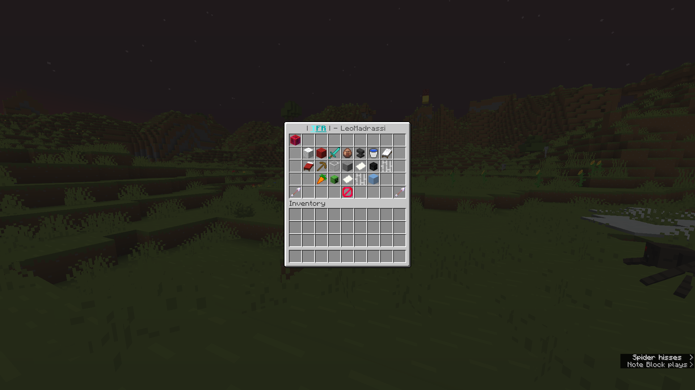
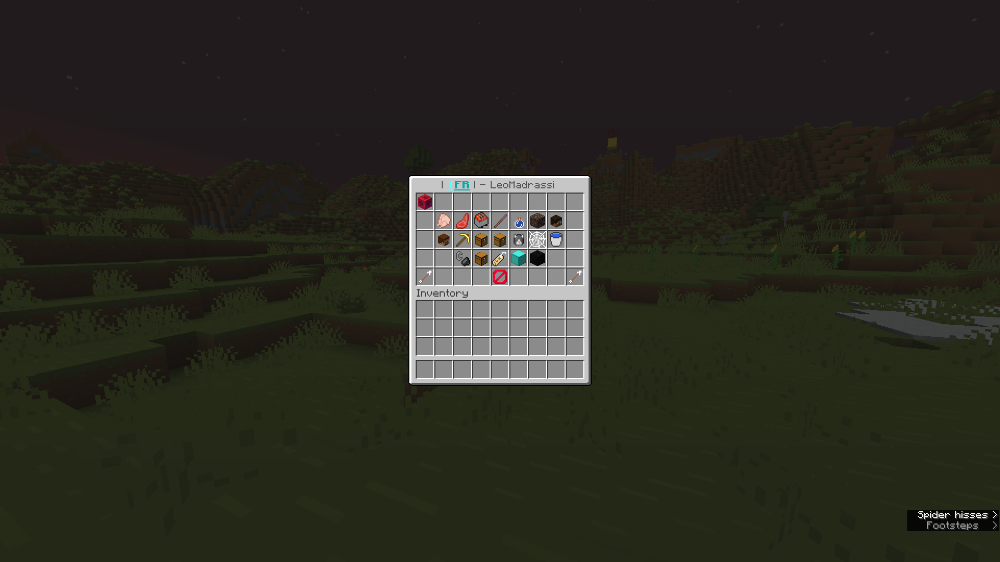
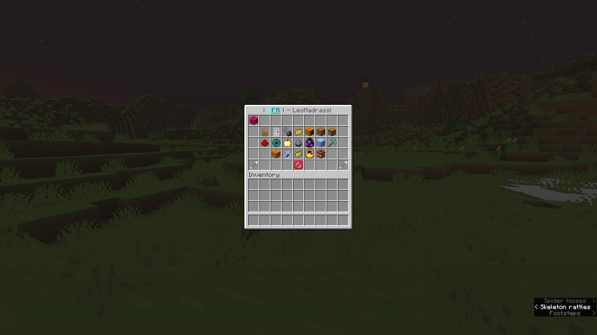
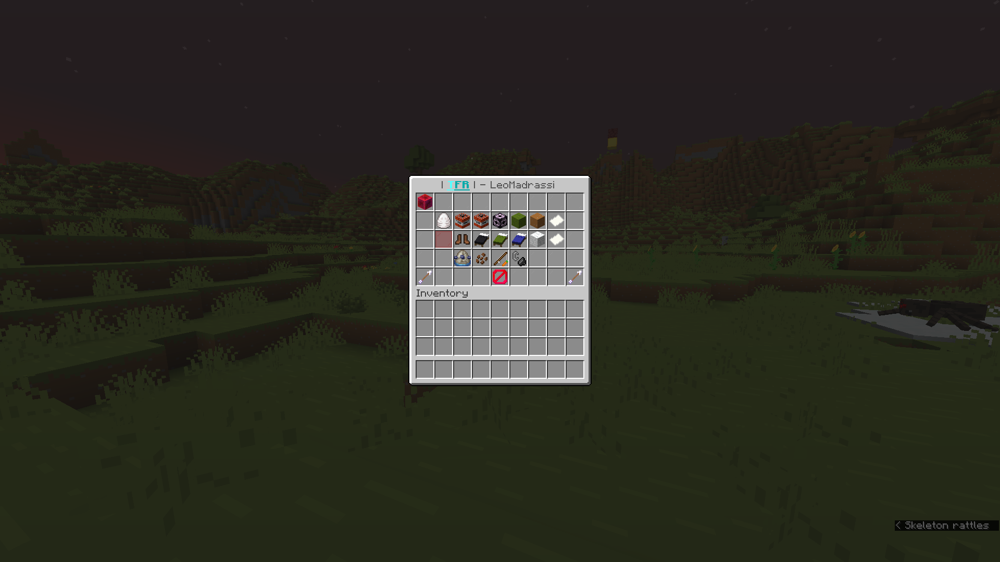

# TrollingFreedomReborn 🎭

**TrollingFreedomReborn** is a powerful, modernized Minecraft troll plugin featuring a comprehensive GUI with over 70 unique, hilarious, and surprising trolls to prank your friends. This is a high-performance, updated fork of the original TrollingFreedom project.

**Fully supported version:** 1.21.11  
**Versions that may work:** 1.14 and above

* For versions 1.20.5 and before, use [TrollingFreedom_Continue](https://github.com/Lumine1909/TrollingFreedom_Continue)
* For version 1.19 and before use [iangry0/TrollingFreedom](https://github.com/iangry0/TrollingFreedom)
* Original plugin link: [SpigotMC - TrollingFreedom](https://www.spigotmc.org/resources/%E2%AD%90-trollingfreedom-%E2%AD%90-1-free-troll-plugin-with-gui.53419/)

---

## 🚀 Features

### 🛠️ General
* **Highly Customizable:** Tweak almost every feature via the `config.yml`.
* **Language Support:** Removed Chinese support from original for the sake of my insanity.
* **Safety First:** Includes a **Blocklist** to protect specific players (like Admins) from being trolled.
* **Modernized Code:** Refactored for stability on 1.18 - 1.21.11+.

### 📦 Dependencies
* **ProtocolLib** (Required)
* **EssentialsX** (Useful)
* **SkinRestorer** (Optional, gives better experience on cracked servers)
* **Citizens2** (Required only for the Herobrine troll)

### 🖱️ The Troll Menu
Open the main interface with `/trollgui` to access over 70 unique actions:
* **Classic Trolls:** Herobrine (NPC), Fake Ban, Fake Crash, OP Troll, and TNT Troll.
* **Interactive Trolls:** Control player movement, Inventory See, and Spin.
* **Visual/Audio Pranks:** Ghast Screams, Guardian Hallucinations, Pumpkin Head, and Flash Screen.
* **Chaos:** Nuke Troll, Coffin Dance (with music!), Rocket Launch, and Rain Items.
* **World & Bed:** Prevent Sleep, World Loading fake-out, and "Monsters Nearby" messages.

---

## 📸 Screenshots

### Menu

*The interactive GUI makes trolling easy and fast.*

---

## 💻 Commands & Permissions

| Command | Description | Permission |
| :--- | :--- | :--- |
| `/troll` | Opens the main Troll GUI | `trollingfreedom.open` |
| `/trollf <player> <troll>` | Execute a troll via command | `trollingfreedom.trollf` |
| `/untroll <player>` | Instantly remove all active trolls | `trollingfreedom.untroll` |
| `/troll reload` | Reload the plugin configuration | `trollingfreedom.reload` |
| `/panicstoptroll` | Resets all plugin tasks in case of something breaking | `trollingfreedom.panic` |

**Master Permission:** `trollingfreedom.*`

---

## 📜 Credits & History

This project is a **Reborn** version of the original "TrollingFreedom" plugin, maintained to keep the fun alive on modern Minecraft versions.

* **Current Developer:** [NotDefined67](https://github.com/NotDefined67)
* **Forked From:** [Lumine1909's TrollingFreedom_Continue](https://github.com/Lumine1909/TrollingFreedom_Continue)
* **Original Author:** [iAngry0 (Original TrollingFreedom)](https://github.com/iangry0/TrollingFreedom)
* **AI Assistance:** Credits to **Gemini Flash** for logic generation and refactoring.
* **Translations:** Special thanks to **Cha_Shao** for the original Chinese translation.

---

## ⚖️ License
This project is open-source and licensed under the **GNU General Public License v3.0**. You must provide attribution to the original authors and keep derivative works under the same license.

You are welcome to fork and take the project from here on as long as you give the proper credits to me and other authors (iangry0 & Lumine1909).

---

## 🔧 CHANGELOG
[CHANGELOG](CHANGELOG.md)

## 🔧 Maintenance Note
I decided to fork and maintain this when I needed to use it myself. I'll be honest: I don't understand half the things in this plugin! I haven't coded in a long time, so a significant portion of the logic was AI-generated. 

The code is still quite messy—it needs a braver person to fix it properly. Feel free to contribute; credits will be given below.

---

## 📝 Roadmap , Known Issues & TODO
[TODO](TODO.md)

## 🛠️ Support & Links
* **Source Code:** [GitHub Repository](https://github.com/NotDefined67/TrollingFreedomReborn)
* **Report Bugs:** [GitHub Issues](https://github.com/NotDefined67/TrollingFreedomReborn/issues)
* **Developer Discord:** `uball`

> [!NOTE]
> Feel free to open an issue or ping me on Discord if I missed an update or you have a suggestion. If you report a bug or suggest a feature that gets implemented, you will be credited in the next commit!
