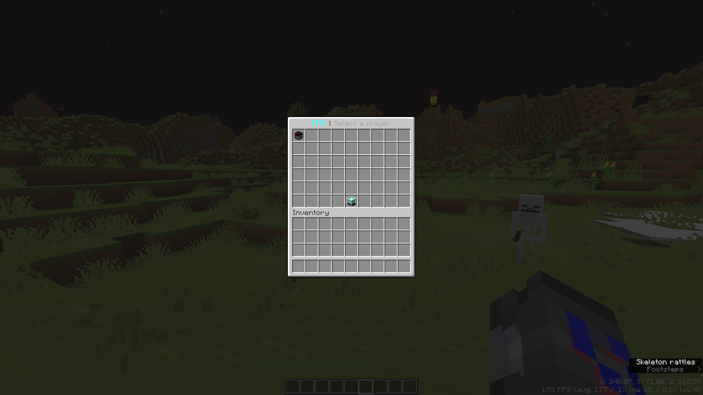
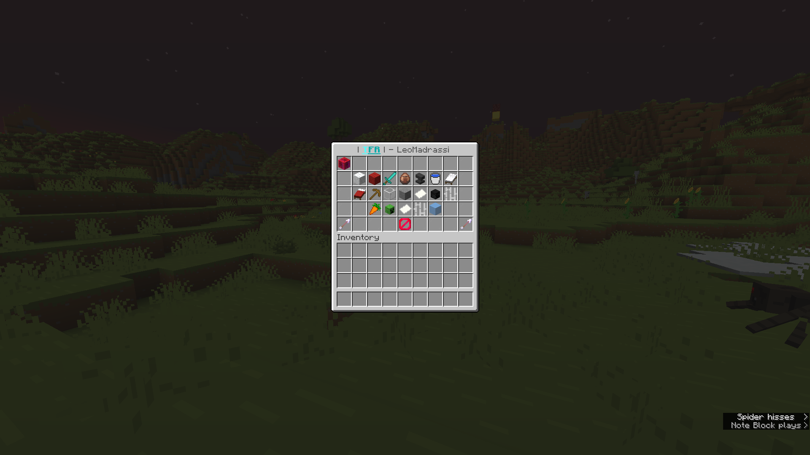
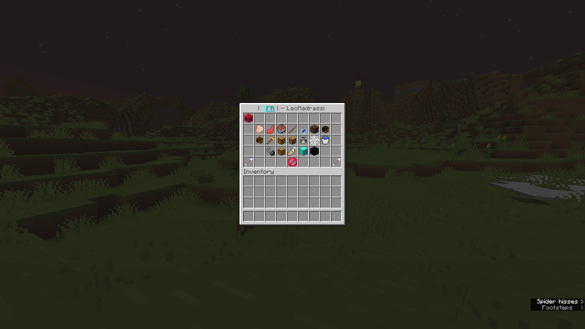
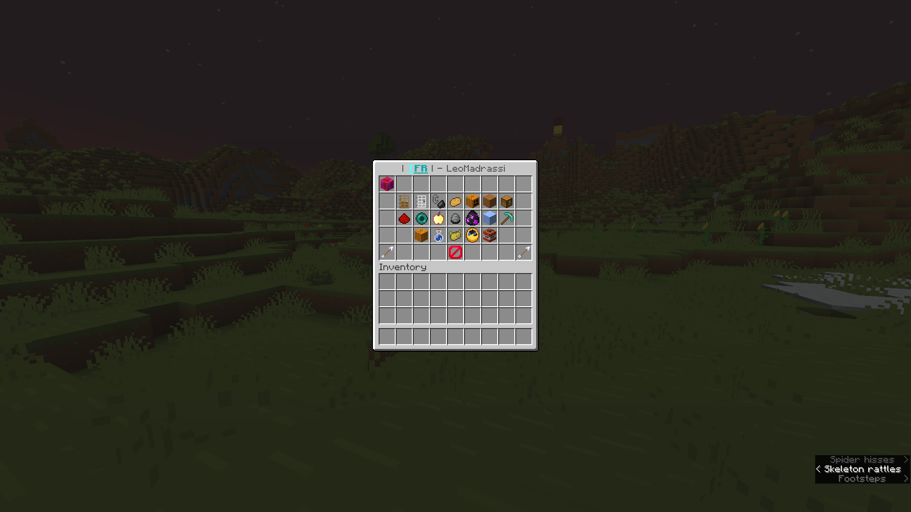
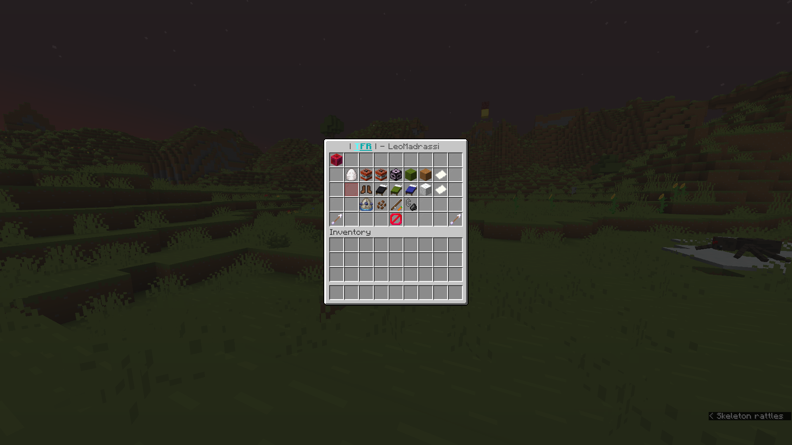

# TrollingFreedomReborn

I forked and modernized the original TrollingFreedom plugin because I needed it for my own server. Its a GUI-based troll plugin with 80+ ways to mess with your friends on Paper 1.21.11.

**Works on:** 1.21.11  
**Might work on:** 1.14+

- For 1.20.5 and below use [TrollingFreedom_Continue](https://github.com/Lumine1909/TrollingFreedom_Continue)
- For 1.19 and below use [iangry0/TrollingFreedom](https://github.com/iangry0/TrollingFreedom)
- Original plugin: [SpigotMC](https://www.spigotmc.org/resources/%E2%AD%90-trollingfreedom-%E2%AD%90-1-free-troll-plugin-with-gui.53419/)

---

## What it does

Open `/trollgui` and you get a menu with pages of trolls. Click one to activate it on a player, right-click to stop it. Simple.

**Categories:**
- **Classic:** Herobrine (NPC), Fake Ban/OP/Crash, TNT, Coffin dance with music
- **Movement:** Control players, freeze them, launch them, invert their controls
- **Chat:** Random messages, deafen, explode on chat, nicknames
- **Explosion:** Exploding chickens, rainbow sheep bombs, kitty cannon, nukes
- **Inventory:** Drop all, rave, lock, randomize
- **Beds:** Explode beds, stop sleep, fake messages
- **Packet tricks:** End credits, demo screen, guardian hallucinations, world loading screen
- **Random:** Annoy, burn, starve, void, vomit, silverfish, ring of fire, on and on

### Dependencies

- **ProtocolLib** (required - auto-downloads if missing)
- **EssentialsX** (optional - needed for nickname troll)
- **Citizens2** (optional - needed only for Herobrine)
- **SkinRestorer** (optional - better on cracked servers)

---

## Screenshots

---

## Commands

| Command | What it does | Permission |
|---------|-------------|------------|
| `/troll` or `/trollgui` | Opens the troll menu | `trollingfreedom.open` |
| `/trollf <player> <troll>` | Troll someone from command | `trollingfreedom.trollf` |
| `/untroll <player>` | Stop all trolls on a player | `trollingfreedom.untroll` |
| `/untroll <player> <troll>` | Stop a specific troll | `trollingfreedom.untroll` |
| `/untroll all` | Stop everything for everyone | `trollingfreedom.untroll` |
| `/panicstoptroll` | Nuclear button - kills all plugin tasks | `trollingfreedom.panic` |
| `/troll reload` | Open settings menu | `trollingfreedom.reload` |
| `/troll add-blocked <player>` | Protect a player from being trolled | `trollingfreedom.open` |
| `/troll remove-blocked <player>` | Unprotect a player | `trollingfreedom.open` |
| `/troll toggle-troll-op` | Allow/disallow trolling ops | `trollingfreedom.open` |
| `/troll giveskull` | Get the plugin skull item | `trollingfreedom.open` |
| `/control <player>` | Take over their movement and chat | `trollingfreedom.trollf` |

**Master permission:** `trollingfreedom.*`

---

## Config

Everything is in `src/main/resources/config.yml`. Open it up, the comments tell you what each thing does.

Stuff youll actually want to change:

- **Blocklist** — Add names under `blocklist:` and they cant be trolled. I put myself and Herobrine in there by default.
- **allow-troll-op** — Set to `false` if you dont want ops getting trolled.
- **untroll-on-quit** — Auto-untroll players when they log off.
- **custom-aliases** — Uncomment to add extra command names for `/trollf` and `/trollgui`.
- **troll-config.randomchat** — The pool of messages the random chat troll pulls from. Replace with your own.
- **Items** — Every trolls GUI name and description is editable under `items:`.

Everything else is just chat strings and GUI labels. Change whatever.

---

## Credits

- **Me (Leo Madrassi)** — [leomadrassidev](https://github.com/leomadrassidev)
- Forked from [Lumine1909's TrollingFreedom_Continue](https://github.com/Lumine1909/TrollingFreedom_Continue)
- Original by [iAngry0](https://github.com/iangry0/TrollingFreedom)
- Chinese translation by **Cha_Shao**

---

## License

GNU GPL v3. Fork it, modify it, just keep the same license and credit the original authors.

---

[CHANGELOG](CHANGELOG.md) · [TODO](TODO.md)

## Support

- GitHub: [leomadrassidev/TrollingFreedomReborn](https://github.com/leomadrassidev/TrollingFreedomReborn)
- Discord: `uball`

> Got a bug or suggestion? Open an issue or ping me. If I use your idea you get credited in the next commit.
